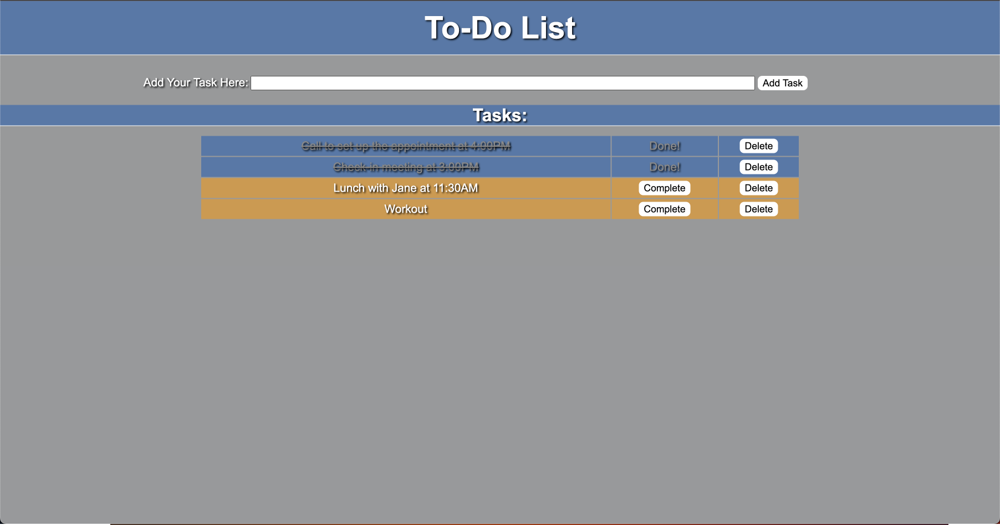

# Project Name

SQL To-Do-List

## Description

Duration: 10 Hours

This project is a to-do list web app built utilizing HTML, CSS, JavaScript, jQuery, Node.js, Express, Postgres, and Postico. The idea behind this web app is to allow the user to create a to-do list where they are able to mark a task as completed and delete a task as needed. The task entered by the user will be stored in an SQL database, which will allow the data to persist. Once the page has been loaded, the to-do list is fetched from the database, and displayed on the DOM.

## Screen Shot

## Prerequisites
<ul>
    <li>jQuery</li>
    <li>Node.js</li>
    <li>Express</li>
    <li>Postgres</li>
    <li>Postico</li>
</ul>

## Installation
<ol>
    <li>Go to: https://github.com/FCLee12/weekend-sql-to-do-list</li>
    <li>Look at the top right of the webpage for the 'fork' button</li>
    <li>Create a fork under your own GitHub account ***** Verify you are in your own fork of the project ***** -At the top left of the webpage, you should see the path to the repo -Your GitHub account name should appear before the first '/'</li>
    <li>Open your terminal</li>
    <li>Navigate to the desired location you want to place the project files using the terminal</li>
    <li>On the webpage of your forked copy, look for the 'code' button</li>
    <li>Assuming you've set up your SSH, click on the SSH tab and copy the file path</li>
    <li>Back on your terminal, enter the following into your terminal: git clone PASTE-COPIED-FILE-PATH-HERE</li>
    <li>Hit enter, the repo will be downloaded into your current working directory</li>
    <li>The repo should now exist in your local machine</li>
    <li>cd into the repo</li>
    <li>
        <ol>
            <li>Run the following commands in your terminal, waiting each time for installation to complete before running the next command:</li>
            <li>npm init --yes</li>
            <li>npm install</li>
        </ol>
    </li>
    <li>Upon completion of those installs, you have to start the server with the following command: node server/server.js</li>
    <li>In a browser, go to: localhost:5000 to view the webpage, the to-do list app is now ready for use</li>
</ol>